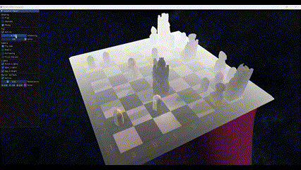
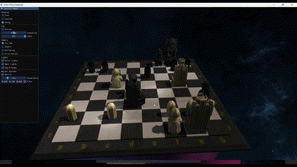
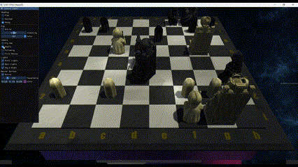
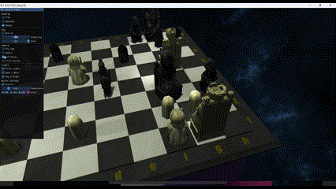

# Chess3D
Chess3D is an animation developed in C++ with OpenGL. This project is a base for analysing and implementing various Computer Graphics algorithms.

## Shading
3 types of shading based on Phong illumiantion model are availbale via shaders:
- flat shading,
- Gouraud shading,
- Phong shading.

## Fog
Custom fog system is implemented via shaders.

  

## Camera
3 types of camera are avilable:
- Fly Camera - free flying around scene,
- Static Camera - attatched to constant point,
- Following Camera - set to follow moving piece,
- First Person Camera - attatched to moving piece.

  

  

  

  

## Installing
For the project to work additional packages shall be installed (preferably using vcpkg):
`vcpkg install glfw3 glad[gl-api-45,loader] glm assimp imgui[glfw-binding,opengl3-binding] stb``

## Camera movement
To operate camera WSAD shall be used for up-down and left-right movement. Additionally, SHIFT may be used to move with higher speed.

Right mouse button is responsible for rotation of camera. Additionally, SHIFT may be used to roatate around scene.

When clicking C button, user enters 'no cursor' mode, in which there is no need for right-clicking mouse to rotate.

## Bezier Surface
Surface is located under the main scene (under chessboard). It is rendered only using phong shading, which means that changing shading type for main scene does not apply for Bezier surface.